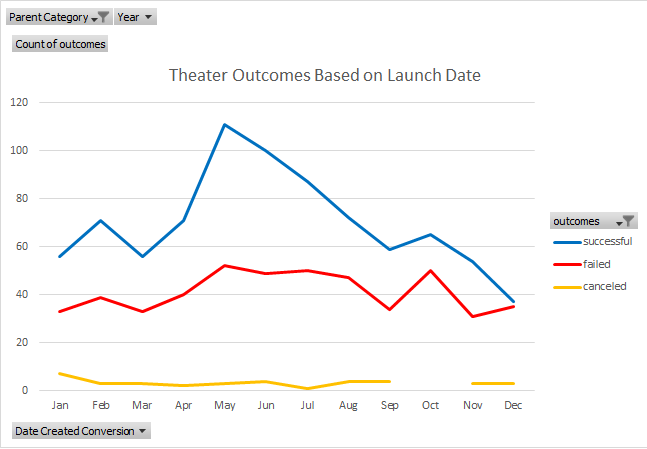
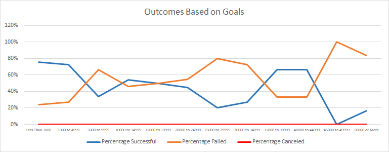

# Kickstarting with Excel

## Overview of Project

In first week Challenge we will be able to see how grafts change by filtering the data to a specific data we want to pull out

- - - 

### Purpose

In this Challenge we are putting our knowledge into practice which are:

* Creating a PivotTable
* Using the correct and different formulas to get the data
* Saving charts as a png imagen
* Creating a repository
* Uploading the finished challenge with pictures

- - -

## Analysis and Challenges

### Analysis of Outcomes Based on Launch Date

In this graft we filtered de pivot table base on theater and we can see how that change base on every month and base on every category of successful, failed and canceled

- - -

### Analysis of Outcomes Based on Goals

In the graft we can see how the percentage is changing base on the range, and that happens with percentage successful because we can see how on beginning start with a good percentage but is changing in between the range number, and percentage fail we can see how started with a low percentage and going up in between the range, on percentage canceled there is not change because is one result for everything 0%

- - -

### Challenges and Difficulties Encountered

In this particular Challenge I had few issues and trouble getting some of the formulas I needed it to be able to proceed to finish the challenge, I also had hard time getting one of the graft to look exactly as the imagen shown on instructions.

- - -

## Results

- What are two conclusions you can draw about the Outcomes based on Launch Date?
    1) When there is not filter on Parent Category you can see how the graft show pretty much similar ranges throughout the year
    2) When you filter Parent Category on Theatre con can see a big different throughout the year for all three categories

- What can you conclude about the Outcomes based on Goals?
    We can see differnces between them all, how Successful start with a high percentage and go up and down throughout the range but on the last range we can see how it went all the way down,
    with Failed we can see how it started with a low percentage and have up and down on different range but when Successful goes all de way down Failed went all the way up to 100%,
    for Canceled there is not change or moves

- What are some limitations of this dataset?
    When we filter Outcomes on Canceled for Outcomes Base on Goals results are 0% because there is not information base on that filter.

- What are some other possible tables and/or graphs that we could create?
    In my opinion we can posible create a bar graft base on the data for this specific challenge, it would be/look clean and organize easy to locate what we look for
    
